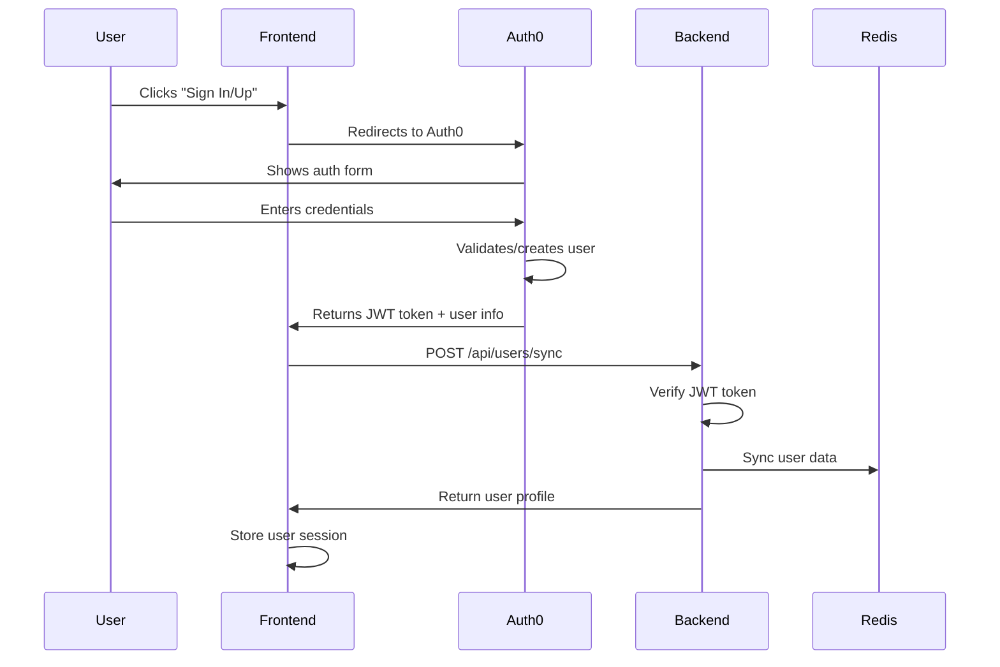

# Naptha Course Creator - Complete Documentation

## 📋 Table of Contents

1. [Overview](#overview)
2. [Architecture](#architecture)
3. [Quick Start](#quick-start)
4. [Authentication System](#authentication-system)
5. [Course Management](#course-management)
6. [Staged Course Generation](#staged-course-generation)
7. [API Reference](#api-reference)
8. [Security Features](#security-features)
9. [Database Schema](#database-schema)
10. [Environment Configuration](#environment-configuration)
11. [Error Handling](#error-handling)
12. [Testing](#testing)
13. [Troubleshooting](#troubleshooting)
14. [Contributing](#contributing)

---

## Overview

The Naptha Course Creator is a comprehensive platform for creating AI-powered courses with human-in-the-loop capabilities. The system allows users to generate educational content from GitHub repositories using a staged, interactive approach.

### Key Features

- **AI-Powered Course Generation**: Create courses from GitHub repositories
- **4-Stage Interactive Process**: Repository analysis → Document processing → Learning pathways → Course generation
- **Modern Web Interface**: React-based dashboard with accordion-style UI
- **Secure Authentication**: Auth0 integration with JWT tokens
- **Real-time Progress Tracking**: Live updates during generation process
- **User Data Isolation**: Individual workspace for each user
- **Scalable Architecture**: Microservices with Redis and Celery

---

## Architecture

### System Components

```
┌─────────────────┐    ┌─────────────────┐    ┌─────────────────┐
│     Frontend    │    │     Backend     │    │     Worker      │
│   React + Vite  │◄──►│    FastAPI      │◄──►│     Celery      │
│   Auth0 React   │    │   JWT Verify    │    │   Task Queue    │
└─────────────────┘    └─────────────────┘    └─────────────────┘
         │                       │                       │
         └───────────────────────┼───────────────────────┘
                                 │
                    ┌─────────────────┐
                    │      Redis      │
                    │  User Data +    │
                    │  Task Queue     │
                    └─────────────────┘
```

### Technology Stack

- **Frontend**: React 18, Vite, TailwindCSS, Auth0 React SDK
- **Backend**: FastAPI, Redis, Auth0 JWT verification
- **Worker**: Celery for background tasks
- **Database**: Redis for user data and session storage
- **Authentication**: Auth0 with JWT tokens
- **File Storage**: Local filesystem with organized structure

---

## Quick Start

### Prerequisites

- Node.js 16+
- Python 3.8+
- Redis server
- Auth0 account and application

### Installation

1. **Clone the repository**
   ```bash
   git clone <repository-url>
   cd course-creator
   ```

2. **Setup environment**
   ```bash
   make install
   ```

3. **Configure environment variables**
   ```bash
   # Backend (.env)
   AUTH0_DOMAIN=naptha-ai.us.auth0.com
   AUTH0_CLIENT_ID=your_client_id
   AUTH0_API_AUDIENCE=https://naptha-ai.us.auth0.com/api/v2/
   REDIS_HOST=localhost
   REDIS_PORT=6379
   ROOT_DATA_DIR=./data
   
   # Frontend (.env)
   VITE_AUTH0_DOMAIN=naptha-ai.us.auth0.com
   VITE_AUTH0_CLIENT_ID=your_client_id
   VITE_AUTH0_AUDIENCE=https://naptha-ai.us.auth0.com/api/v2/
   VITE_API_BASE_URL=http://localhost:8000/api
   ```

4. **Start development services**
   ```bash
   make dev-up
   ```

5. **Access the application**
   - Frontend: http://localhost:5173
   - Backend API: http://localhost:8000
   - API Documentation: http://localhost:8000/docs

---

## Authentication System

### Auth0 Integration

The system uses Auth0 for authentication with a unified backend sync approach. Both signup and signin operations follow the same backend flow.

#### Authentication Flow



### JWT Token Verification

The backend uses RS256 algorithm to verify JWT tokens:

```python
def verify_token(self, token: str) -> Dict[str, Any]:
    """Verify Auth0 JWT token"""
    # 1. Fetch Auth0 public keys (JWKS)
    # 2. Decode token header to get key ID
    # 3. Find matching public key
    # 4. Verify token signature and claims
    # 5. Return decoded payload
```

### User Data Models

#### UserSync (Request)
```python
class UserSync(BaseModel):
    auth0_id: str
    email: str
    name: str
    picture: Optional[str] = None
    email_verified: bool = False
```

#### UserInDB (Response)
```python
class UserInDB(BaseModel):
    auth0_id: str
    email: str
    name: str
    picture: Optional[str] = None
    email_verified: bool = False
    created_at: datetime
    updated_at: datetime
```

---

## Course Management

### Course Lifecycle

Courses follow a structured lifecycle with distinct statuses:

```
Draft → Generating → Completed
   ↓         ↓          ↓
 Failed ← Failed ← Failed
```

### Course Data Models

#### CourseCreate (Request)
```python
class CourseCreate(BaseModel):
    title: str = Field(..., min_length=1, max_length=200)
    description: Optional[str] = Field(None, max_length=1000)
```

#### Course (Response)
```python
class Course(BaseModel):
    course_id: str
    title: str
    description: Optional[str] = None
    status: CourseStatus = CourseStatus.DRAFT
    created_at: datetime
    updated_at: datetime
```

#### CourseStatus Enum
```python
class CourseStatus(str, Enum):
    DRAFT = "draft"
    GENERATING = "generating"
    COMPLETED = "completed"
    FAILED = "failed"
```

### File System Organization

```
data/                           # Root data directory
├── google-oauth2_111962...     # User directory (sanitized Auth0 ID)
│   ├── course-uuid-1/
│   │   ├── cache/             # Cache files for this course
│   │   └── generated/         # Generated course content
│   ├── course-uuid-2/
│   │   ├── cache/
│   │   └── generated/
│   └── ...
└── auth0_user_456789/         # Another user's directory
    ├── course-uuid-3/
    │   ├── cache/
    │   └── generated/
    └── ...
```

---

## Staged Course Generation

### 4-Stage Process

The course generation follows a structured 4-stage process with modern accordion-style UI:

#### Stage 1: Repository Setup
- **Purpose**: GitHub repository analysis and folder selection
- **User Input**: Repository URL, folder selection, overview document
- **Output**: Analyzed repository structure and selected content

#### Stage 2: Document Analysis
- **Purpose**: AI-powered document processing
- **Process**: Content extraction, structure analysis, concept identification
- **Output**: Processed documentation with key insights

#### Stage 3: Learning Pathways
- **Purpose**: Interactive pathway creation and customization
- **Options**: Multiple difficulty levels, customizable learning paths
- **Output**: Selected learning pathway with modules

#### Stage 4: Course Generation
- **Purpose**: Final AI-powered course creation
- **Process**: Content generation, assessment creation, material export
- **Output**: Complete course with downloadable materials

### User Interface

#### Modern Accordion Design
- **Visual Progress Tracking**: Step indicators with completion states
- **Smooth Animations**: Expand/collapse transitions
- **Real-time Updates**: Live progress bars and status indicators
- **Intuitive Navigation**: Clear next steps and back buttons

#### Key UI Components
- **CourseCreationPage**: Main orchestrator for the 4-stage process
- **StageContent**: Individual stage components with specific functionality
- **Progress Indicators**: Visual feedback for each stage
- **Status Management**: Real-time updates via polling

---

## API Reference

### Authentication Endpoints

#### POST /api/users/sync
Sync user data from Auth0 to backend.

**Headers:**
```
Authorization: Bearer <jwt_token>
Content-Type: application/json
```

**Request Body:**
```json
{
  "auth0_id": "google-oauth2|111962411139153579092",
  "email": "user@example.com",
  "name": "John Doe",
  "picture": "https://lh3.googleusercontent.com/...",
  "email_verified": true
}
```

**Response:**
```json
{
  "auth0_id": "google-oauth2|111962411139153579092",
  "email": "user@example.com",
  "name": "John Doe",
  "picture": "https://lh3.googleusercontent.com/...",
  "email_verified": true,
  "created_at": "2024-01-15T10:30:00Z",
  "updated_at": "2024-01-15T10:30:00Z"
}
```

#### GET /api/users/me
Get current user profile.

**Headers:**
```
Authorization: Bearer <jwt_token>
```

**Response:**
```json
{
  "auth0_id": "google-oauth2|111962411139153579092",
  "email": "user@example.com",
  "name": "John Doe",
  "picture": "https://lh3.googleusercontent.com/...",
  "email_verified": true,
  "created_at": "2024-01-15T10:30:00Z",
  "updated_at": "2024-01-15T10:30:00Z"
}
```

### Course Management Endpoints

#### POST /api/projects/
Create a new course project.

**Headers:**
```
Authorization: Bearer <jwt_token>
Content-Type: application/json
```

**Request Body:**
```json
{
  "title": "Introduction to Python",
  "description": "A comprehensive course covering Python basics"
}
```

**Response:**
```json
{
  "course_id": "550e8400-e29b-41d4-a716-446655440000",
  "title": "Introduction to Python",
  "description": "A comprehensive course covering Python basics",
  "status": "draft",
  "created_at": "2024-01-15T10:30:00Z",
  "updated_at": "2024-01-15T10:30:00Z"
}
```

#### GET /api/projects/
Get all courses for the authenticated user.

**Headers:**
```
Authorization: Bearer <jwt_token>
```

**Response:**
```json
[
  {
    "course_id": "550e8400-e29b-41d4-a716-446655440000",
    "title": "Introduction to Python",
    "description": "A comprehensive course covering Python basics",
    "status": "draft",
    "created_at": "2024-01-15T10:30:00Z",
    "updated_at": "2024-01-15T10:30:00Z"
  }
]
```

#### GET /api/projects/{course_id}
Get a specific course by ID.

**Headers:**
```
Authorization: Bearer <jwt_token>
```

**Response:**
```json
{
  "course_id": "550e8400-e29b-41d4-a716-446655440000",
  "title": "Introduction to Python",
  "description": "A comprehensive course covering Python basics",
  "status": "draft",
  "created_at": "2024-01-15T10:30:00Z",
  "updated_at": "2024-01-15T10:30:00Z"
}
```

#### PUT /api/projects/{course_id}
Update an existing course.

**Headers:**
```
Authorization: Bearer <jwt_token>
Content-Type: application/json
```

**Request Body:**
```json
{
  "title": "Advanced Introduction to Python",
  "description": "Updated comprehensive course",
  "status": "generating"
}
```

**Response:**
```json
{
  "course_id": "550e8400-e29b-41d4-a716-446655440000",
  "title": "Advanced Introduction to Python",
  "description": "Updated comprehensive course",
  "status": "generating",
  "created_at": "2024-01-15T10:30:00Z",
  "updated_at": "2024-01-15T11:45:00Z"
}
```

#### DELETE /api/projects/{course_id}
Delete a course and all associated files.

**Headers:**
```
Authorization: Bearer <jwt_token>
```

**Response:**
```json
{
  "message": "Course deleted successfully"
}
```

### Course Generation Endpoints

#### POST /api/course-generation/{course_id}/start
Start course generation process.

**Headers:**
```
Authorization: Bearer <jwt_token>
Content-Type: application/json
```

**Request Body:**
```json
{
  "repo_url": "https://github.com/username/repository"
}
```

**Response:**
```json
{
  "task_id": "550e8400-e29b-41d4-a716-446655440000",
  "status": "started",
  "message": "Course generation started"
}
```

#### GET /api/course-generation/{course_id}/status
Get generation status.

**Headers:**
```
Authorization: Bearer <jwt_token>
```

**Response:**
```json
{
  "task_id": "550e8400-e29b-41d4-a716-446655440000",
  "status": "running",
  "current_stage": "clone_repo",
  "progress_percentage": 25,
  "error_message": null
}
```

#### POST /api/course-generation/{course_id}/stage2
Proceed to document analysis stage.

**Headers:**
```
Authorization: Bearer <jwt_token>
Content-Type: application/json
```

**Request Body:**
```json
{
  "include_folders": ["docs", "src"],
  "overview_doc": "README.md"
}
```

#### GET /api/course-generation/{course_id}/stage1
Get stage 1 results.

**Headers:**
```
Authorization: Bearer <jwt_token>
```

**Response:**
```json
{
  "available_folders": ["docs", "src", "tests"],
  "suggested_overview_docs": ["README.md", "CONTRIBUTING.md"],
  "available_files": ["file1.md", "file2.md"]
}
```

### Health Check Endpoint

#### GET /health
Check service health.

**Response:**
```json
{
  "status": "healthy",
  "timestamp": "2024-01-15T10:30:00Z"
}
```

---

## Security Features

### Authentication Security

1. **JWT Verification**
   - Algorithm: RS256 (RSA with SHA-256)
   - Key Source: Auth0 JWKS endpoint
   - Validation: Signature, audience, issuer, expiration

2. **Token Ownership Verification**
   ```python
   if current_user.get("sub") != user_data.auth0_id:
       raise HTTPException(status_code=403, detail="Token doesn't match user ID")
   ```

3. **Access Control**
   - Users can only access their own data
   - JWT required for all protected endpoints
   - CORS configured for frontend domain

### Data Security

1. **Course Ownership**
   - Users can only access their own courses
   - Ownership verification on each operation
   - Secure course ID generation (UUID)

2. **Data Isolation**
   - Individual user directories
   - Course-specific subdirectories
   - Path sanitization for filesystem safety

3. **File System Security**
   - Sanitized user IDs for directory names
   - Restricted file access within user boundaries
   - Proper permission handling

---

## Database Schema

### Redis Data Structure

#### User Data
```
Key: user:{auth0_id}
Value: {
  "auth0_id": "google-oauth2|111962411139153579092",
  "email": "user@example.com",
  "name": "John Doe",
  "picture": "https://lh3.googleusercontent.com/...",
  "email_verified": true,
  "created_at": "2024-01-15T10:30:00Z",
  "updated_at": "2024-01-15T10:30:00Z"
}
```

#### Email Index
```
Key: user_email:{email}
Value: {auth0_id}
```

#### Course Data
```
Key: course:{course_id}
Value: {
  "course_id": "550e8400-e29b-41d4-a716-446655440000",
  "title": "Introduction to Python",
  "description": "A comprehensive course covering Python basics",
  "status": "draft",
  "user_id": "google-oauth2|111962411139153579092",
  "cache_dir": "/path/to/cache",
  "generated_course_dir": "/path/to/generated",
  "created_at": "2024-01-15T10:30:00Z",
  "updated_at": "2024-01-15T10:30:00Z"
}
```

#### User Course Index
```
Key: user_courses:{user_id}
Value: Set of course_ids belonging to the user
```

#### Task Status
```
Key: task:{task_id}
Value: {
  "task_id": "550e8400-e29b-41d4-a716-446655440000",
  "status": "running",
  "current_stage": "clone_repo",
  "progress_percentage": 25,
  "error_message": null,
  "course_id": "550e8400-e29b-41d4-a716-446655440000"
}
```

---

## Environment Configuration

### Backend Environment Variables

```bash
# Auth0 Configuration
AUTH0_DOMAIN=naptha-ai.us.auth0.com
AUTH0_CLIENT_ID=your_client_id
AUTH0_API_AUDIENCE=https://naptha-ai.us.auth0.com/api/v2/
AUTH0_ALGORITHMS=["RS256"]
AUTH0_ISSUER=https://naptha-ai.us.auth0.com/

# Redis Configuration
REDIS_HOST=localhost
REDIS_PORT=6379
REDIS_PASSWORD=optional_password

# Course Data Configuration
ROOT_DATA_DIR=./data

# CORS Configuration
BACKEND_CORS_ORIGINS=["http://localhost:5173"]

# API Configuration
API_HOST=0.0.0.0
API_PORT=8000
```

### Frontend Environment Variables

```bash
# Auth0 Configuration
VITE_AUTH0_DOMAIN=naptha-ai.us.auth0.com
VITE_AUTH0_CLIENT_ID=your_client_id
VITE_AUTH0_AUDIENCE=https://naptha-ai.us.auth0.com/api/v2/

# API Configuration
VITE_API_BASE_URL=http://localhost:8000/api
```

### Docker Compose Configuration

```yaml
version: '3.8'
services:
  backend:
    build: ./backend
    ports:
      - "8000:8000"
    environment:
      - AUTH0_DOMAIN=${AUTH0_DOMAIN}
      - AUTH0_CLIENT_ID=${AUTH0_CLIENT_ID}
      - REDIS_HOST=redis
    depends_on:
      - redis

  frontend:
    build: ./frontend
    ports:
      - "5173:5173"
    environment:
      - VITE_AUTH0_DOMAIN=${AUTH0_DOMAIN}
      - VITE_AUTH0_CLIENT_ID=${AUTH0_CLIENT_ID}

  worker:
    build: ./worker
    environment:
      - REDIS_HOST=redis
    depends_on:
      - redis

  redis:
    image: redis:7-alpine
    ports:
      - "6379:6379"
```

---

## Error Handling

### HTTP Status Codes

| Status Code | Description | Common Causes |
|-------------|-------------|---------------|
| 200 | OK | Successful request |
| 201 | Created | Resource created successfully |
| 400 | Bad Request | Invalid request data |
| 401 | Unauthorized | Missing or invalid JWT token |
| 403 | Forbidden | Insufficient permissions |
| 404 | Not Found | Resource doesn't exist |
| 422 | Unprocessable Entity | Validation errors |
| 500 | Internal Server Error | Server-side errors |

### Error Response Format

```json
{
  "detail": "Error message describing what went wrong",
  "error_code": "SPECIFIC_ERROR_CODE",
  "timestamp": "2024-01-15T10:30:00Z"
}
```

### Common Error Scenarios

#### Authentication Errors

1. **Invalid JWT Token**
   ```json
   {
     "detail": "Could not validate credentials",
     "error_code": "INVALID_TOKEN"
   }
   ```

2. **Token Ownership Mismatch**
   ```json
   {
     "detail": "Token doesn't match user ID",
     "error_code": "TOKEN_MISMATCH"
   }
   ```

3. **Expired Token**
   ```json
   {
     "detail": "Token has expired",
     "error_code": "TOKEN_EXPIRED"
   }
   ```

#### Course Management Errors

1. **Course Not Found**
   ```json
   {
     "detail": "Course not found",
     "error_code": "COURSE_NOT_FOUND"
   }
   ```

2. **Validation Error**
   ```json
   {
     "detail": [
       {
         "loc": ["title"],
         "msg": "field required",
         "type": "value_error.missing"
       }
     ],
     "error_code": "VALIDATION_ERROR"
   }
   ```

3. **Directory Creation Error**
   ```json
   {
     "detail": "Failed to create course directory",
     "error_code": "DIRECTORY_CREATE_FAILED"
   }
   ```

### Frontend Error Handling

#### Error Boundary Component
```javascript
class ErrorBoundary extends React.Component {
  constructor(props) {
    super(props);
    this.state = { hasError: false, error: null };
  }

  static getDerivedStateFromError(error) {
    return { hasError: true, error };
  }

  componentDidCatch(error, errorInfo) {
    console.error('Error caught by boundary:', error, errorInfo);
  }

  render() {
    if (this.state.hasError) {
      return (
        <div className="error-boundary">
          <h2>Something went wrong</h2>
          <details>
            {this.state.error && this.state.error.toString()}
          </details>
        </div>
      );
    }

    return this.props.children;
  }
}
```

#### API Error Handler
```javascript
const handleApiError = (error) => {
  if (error.response) {
    // Server responded with error status
    const { status, data } = error.response;
    switch (status) {
      case 401:
        // Redirect to login
        logout();
        break;
      case 403:
        setError('Access denied');
        break;
      case 404:
        setError('Resource not found');
        break;
      case 422:
        setError('Validation failed');
        break;
      default:
        setError('An error occurred');
    }
  } else if (error.request) {
    // Network error
    setError('Network error - please try again');
  } else {
    // Other error
    setError('An unexpected error occurred');
  }
};
```

---

## Testing

### Manual Testing

#### Authentication Flow
1. Navigate to http://localhost:5173
2. Click "Sign In" or "Sign Up"
3. Complete Auth0 authentication flow
4. Verify user data sync in backend logs
5. Check Redis for stored user data

#### Course Management
1. Create a new course using the "New Course" button
2. Edit course details using the "Edit" button
3. Delete a course using the "Delete" button
4. Verify course data in Redis
5. Check file system for course directories

#### Course Generation
1. Create a new course project
2. Click "Generate Course" to navigate to creation page
3. Enter GitHub repository URL
4. Progress through all 4 stages
5. Verify generated content

### API Testing

#### Authentication Tests
```bash
# Test user sync
curl -X POST http://localhost:8000/api/users/sync \
  -H "Authorization: Bearer YOUR_JWT_TOKEN" \
  -H "Content-Type: application/json" \
  -d '{
    "auth0_id": "google-oauth2|111962411139153579092",
    "email": "user@example.com",
    "name": "John Doe",
    "email_verified": true
  }'

# Test user profile
curl -X GET http://localhost:8000/api/users/me \
  -H "Authorization: Bearer YOUR_JWT_TOKEN"
```

#### Course Management Tests
```bash
# Create course
curl -X POST http://localhost:8000/api/projects/ \
  -H "Authorization: Bearer YOUR_JWT_TOKEN" \
  -H "Content-Type: application/json" \
  -d '{
    "title": "Test Course",
    "description": "Test description"
  }'

# Get all courses
curl -X GET http://localhost:8000/api/projects/ \
  -H "Authorization: Bearer YOUR_JWT_TOKEN"

# Update course
curl -X PUT http://localhost:8000/api/projects/COURSE_ID \
  -H "Authorization: Bearer YOUR_JWT_TOKEN" \
  -H "Content-Type: application/json" \
  -d '{
    "title": "Updated Course Title"
  }'

# Delete course
curl -X DELETE http://localhost:8000/api/projects/COURSE_ID \
  -H "Authorization: Bearer YOUR_JWT_TOKEN"
```

#### Health Check
```bash
# Test health endpoint
curl -X GET http://localhost:8000/health
```

### Automated Testing

#### Backend Tests
```bash
# Run backend tests
cd backend
python -m pytest tests/ -v

# Run specific test file
python -m pytest tests/test_auth.py -v

# Run with coverage
python -m pytest tests/ --cov=app --cov-report=html
```

#### Frontend Tests
```bash
# Run frontend tests
cd frontend
npm test

# Run specific test file
npm test -- --testNamePattern="CourseCard"

# Run with coverage
npm test -- --coverage
```

---

## Troubleshooting

### Common Issues and Solutions

#### Authentication Issues

**Issue: "Invalid token" Error**
- **Cause**: JWT token expired, malformed, or invalid signature
- **Solution**: 
  - Check Auth0 configuration in environment variables
  - Verify JWT token format using jwt.io
  - Ensure JWKS endpoint is accessible
  - Clear browser cache and re-authenticate

**Issue: "Token ownership mismatch" Error**
- **Cause**: JWT token doesn't match user data being synced
- **Solution**:
  - Verify Auth0 user ID format matches token
  - Check for multiple Auth0 connections
  - Ensure token is for the correct user

**Issue: CORS Error**
- **Cause**: Frontend domain not allowed in CORS settings
- **Solution**:
  - Add frontend URL to `BACKEND_CORS_ORIGINS`
  - Restart backend service
  - Check for trailing slashes in URLs

#### Course Management Issues

**Issue: "Course not found" Error**
- **Cause**: Course doesn't exist or user doesn't have access
- **Solution**:
  - Verify course ID format (should be UUID)
  - Check course ownership
  - Ensure user is authenticated correctly

**Issue: Directory creation errors**
- **Cause**: Insufficient permissions or storage space
- **Solution**:
  - Check write permissions for `ROOT_DATA_DIR`
  - Verify available disk space
  - Ensure directory exists and is writable

**Issue: Redis connection errors**
- **Cause**: Redis service unavailable or misconfigured
- **Solution**:
  - Check Redis service status
  - Verify Redis connection settings
  - Test connection with `redis-cli ping`

#### Course Generation Issues

**Issue: Repository clone fails**
- **Cause**: Invalid URL, private repository, or network issues
- **Solution**:
  - Verify repository URL format
  - Check if repository is public
  - Ensure network connectivity
  - Try with different repository

**Issue: Generation stuck at specific stage**
- **Cause**: Processing errors or resource limitations
- **Solution**:
  - Check worker logs for errors
  - Verify Celery worker is running
  - Restart worker service
  - Check available memory and CPU

#### Frontend Issues

**Issue: Page not loading or blank screen**
- **Cause**: JavaScript errors or build issues
- **Solution**:
  - Check browser console for errors
  - Verify environment variables
  - Rebuild frontend with `npm run build`
  - Clear browser cache

**Issue: API requests failing**
- **Cause**: Backend not running or incorrect API URL
- **Solution**:
  - Verify backend is running on correct port
  - Check `VITE_API_BASE_URL` setting
  - Test API endpoints directly
  - Check network connectivity

### Debug Commands

#### System Health Checks
```bash
# Check all services
docker-compose ps

# Check Redis connection
redis-cli ping

# Check backend health
curl http://localhost:8000/health

# Check frontend build
cd frontend && npm run build
```

#### Data Inspection
```bash
# View user data in Redis
redis-cli GET "user:google-oauth2|111962411139153579092"

# View course data
redis-cli GET "course:550e8400-e29b-41d4-a716-446655440000"

# View user courses
redis-cli SMEMBERS "user_courses:google-oauth2|111962411139153579092"

# Check file system structure
ls -la ./data/
```

#### Log Analysis
```bash
# Backend logs
docker-compose logs backend

# Frontend logs
docker-compose logs frontend

# Worker logs
docker-compose logs worker

# Redis logs
docker-compose logs redis
```

#### JWT Token Debugging
```bash
# Decode JWT token (without verification)
python -c "
import jwt
token = 'YOUR_JWT_TOKEN'
print(jwt.decode(token, verify=False))
"

# Check token expiration
python -c "
import jwt
from datetime import datetime
token = 'YOUR_JWT_TOKEN'
payload = jwt.decode(token, verify=False)
exp = datetime.fromtimestamp(payload['exp'])
print(f'Token expires at: {exp}')
print(f'Current time: {datetime.now()}')
"
```

---

## Contributing

### Development Guidelines

1. **Code Style**
   - Follow existing code formatting
   - Use meaningful variable and function names
   - Add comments for complex logic
   - Follow PEP 8 for Python code
   - Use ESLint/Prettier for JavaScript code

2. **Testing**
   - Write tests for new features
   - Update existing tests when modifying code
   - Ensure all tests pass before submitting
   - Aim for good test coverage

3. **Documentation**
   - Update relevant documentation
   - Add code comments where needed
   - Update API documentation for endpoint changes
   - Keep this documentation file current

4. **Version Control**
   - Use descriptive commit messages
   - Create feature branches for new work
   - Submit pull requests for review
   - Keep commits focused and atomic

### Development Workflow

1. **Setup Development Environment**
   ```bash
   git clone <repository-url>
   cd course-creator
   make install
   make dev-up
   ```

2. **Create Feature Branch**
   ```bash
   git checkout -b feature/your-feature-name
   ```

3. **Make Changes**
   - Implement your feature
   - Write tests
   - Update documentation

4. **Test Changes**
   ```bash
   # Run backend tests
   cd backend && python -m pytest

   # Run frontend tests
   cd frontend && npm test

   # Manual testing
   # Test in browser at http://localhost:5173
   ```

5. **Submit Pull Request**
   - Push your branch to remote
   - Create pull request
   - Describe changes and testing done
   - Address review feedback

### Available Make Commands

```bash
make help          # Show all available commands
make install       # Install all dependencies
make dev-up        # Start development environment
make dev-down      # Stop development environment
make clean         # Clean up containers and volumes
make test          # Run all tests
make lint          # Run linting
make format        # Format code
make build         # Build for production
```

### Project Structure

```
course-creator/
├── backend/                    # FastAPI backend
│   ├── app/
│   │   ├── core/              # Core configuration
│   │   ├── models/            # Data models
│   │   ├── routers/           # API routes
│   │   ├── services/          # Business logic
│   │   └── main.py            # FastAPI app
│   ├── tests/                 # Backend tests
│   ├── Dockerfile
│   └── requirements.txt
├── frontend/                   # React frontend
│   ├── src/
│   │   ├── components/        # React components
│   │   ├── pages/             # Page components
│   │   ├── App.jsx            # Main app component
│   │   └── main.jsx           # Entry point
│   ├── public/                # Static assets
│   ├── package.json
│   └── vite.config.js
├── worker/                     # Celery worker
│   ├── app/
│   │   ├── course_content_agent/  # Course generation logic
│   │   ├── main.py            # Worker entry point
│   │   └── tasks.py           # Celery tasks
│   ├── Dockerfile
│   └── requirements.txt
├── docs/                       # Documentation
│   ├── README.md
│   ├── authentication-flow.md
│   ├── course-management.md
│   └── Complete-Documentation.md
├── data/                       # Course data directory
├── docker-compose.yml          # Docker services
├── Makefile                    # Development commands
└── README.md                   # Main project README
```

---

## Additional Resources

### Documentation Links
- [FastAPI Documentation](https://fastapi.tiangolo.com/)
- [Auth0 React SDK](https://auth0.com/docs/quickstart/spa/react)
- [Redis Documentation](https://redis.io/docs/)
- [Celery Documentation](https://docs.celeryq.dev/)
- [React Documentation](https://react.dev/)
- [Vite Documentation](https://vitejs.dev/)
- [TailwindCSS Documentation](https://tailwindcss.com/docs)

### Community Resources
- [FastAPI Community](https://fastapi.tiangolo.com/community/)
- [React Community](https://react.dev/community)
- [Auth0 Community](https://community.auth0.com/)

---

**Last Updated:** January 2024  
**Version:** 1.0.0

---

*This documentation is maintained by the development team. For questions or suggestions, please create an issue or submit a pull request.* 