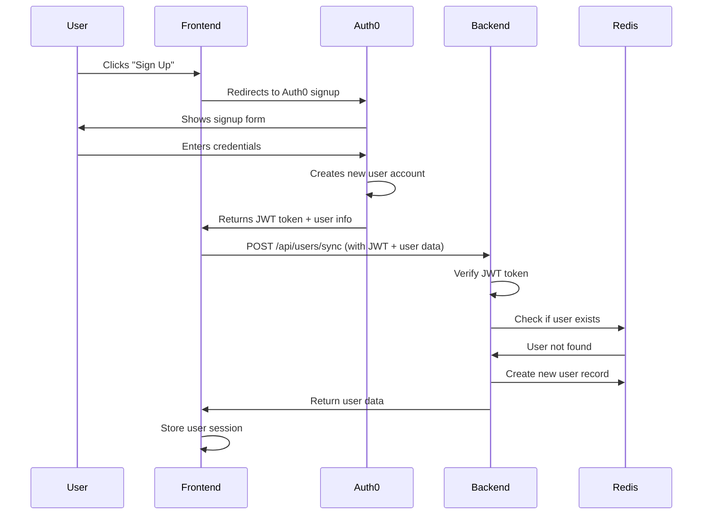
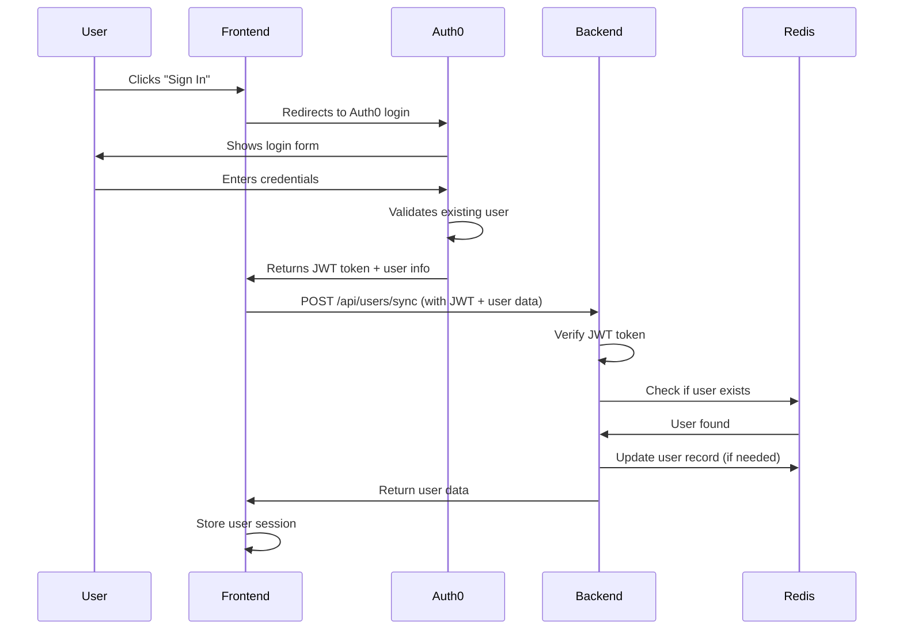

# Authentication Flow Documentation

## Overview

The Naptha Course Creator uses Auth0 for authentication with a unified backend sync approach. Both signup and signin operations follow the same backend flow, with Auth0 handling the distinction between new and existing users.

## System Architecture

- **Frontend**: React app with @auth0/auth0-react
- **Backend**: FastAPI with JWT verification
- **Database**: Redis for user data storage
- **Auth Provider**: Auth0 (naptha-ai.us.auth0.com)

## Authentication Flow

### 1. Signup Flow (New User)



### 2. Signin Flow (Existing User)



## Backend Processing Details

### JWT Token Verification

The backend uses the `AuthService` to verify JWT tokens from Auth0:

```python
# app/services/auth_service.py
def verify_token(self, token: str) -> Dict[str, Any]:
    """Verify Auth0 JWT token"""
    # 1. Fetch Auth0 public keys (JWKS)
    # 2. Decode token header to get key ID
    # 3. Find matching public key
    # 4. Verify token signature and claims
    # 5. Return decoded payload
```

### User Sync Endpoint

The `/api/users/sync` endpoint handles both new and existing users:

```python
@router.post("/sync", response_model=UserInDB)
async def sync_user(
    user_data: UserSync, 
    current_user: Dict[str, Any] = Depends(get_current_user)
):
    # 1. Verify JWT token matches user data
    # 2. Call user_service.sync_user()
    # 3. Return user profile
```

### User Sync Logic

The `UserService.sync_user()` method automatically handles create vs update:

```python
def sync_user(self, user_data: UserSync) -> UserInDB:
    """Sync user data from Auth0 - create if doesn't exist, update if exists"""
    existing_user = self.get_user_by_auth0_id(user_data.auth0_id)
    
    if existing_user:
        return self.update_user(user_data.auth0_id, user_data)
    else:
        return self.create_user(user_data)
```

## Data Models

### UserSync Model (Request)
```python
class UserSync(BaseModel):
    auth0_id: str
    email: str
    name: str
    picture: Optional[str] = None
    email_verified: bool = False
```

### UserInDB Model (Response)
```python
class UserInDB(BaseModel):
    auth0_id: str
    email: str
    name: str
    picture: Optional[str] = None
    email_verified: bool = False
    created_at: datetime
    updated_at: datetime
```

## Redis Data Structure

### User Data Storage
```
Key: user:{auth0_id}
Value: {
    "auth0_id": "google-oauth2|111962411139153579092",
    "email": "user@example.com",
    "name": "John Doe",
    "picture": "https://lh3.googleusercontent.com/...",
    "email_verified": true,
    "created_at": "2024-01-15T10:30:00Z",
    "updated_at": "2024-01-15T10:30:00Z"
}
```

### Email Index
```
Key: user_email:{email}
Value: {auth0_id}
```

## Security Features

### 1. JWT Verification
- **Algorithm**: RS256 (RSA with SHA-256)
- **Key Source**: Auth0 JWKS endpoint
- **Validation**: Signature, audience, issuer, expiration

### 2. Token Ownership Verification
```python
# Ensure JWT token matches the user data being synced
if current_user.get("sub") != user_data.auth0_id:
    raise HTTPException(status_code=403, detail="Token doesn't match user ID")
```

### 3. Access Control
- Users can only access their own data
- JWT required for all protected endpoints
- CORS configured for frontend domain

## API Endpoints

### Authentication Required Endpoints

#### POST /api/users/sync
- **Purpose**: Sync user data from Auth0 to backend
- **Auth**: JWT token required
- **Body**: UserSync model
- **Response**: UserInDB model

#### GET /api/users/me
- **Purpose**: Get current user profile
- **Auth**: JWT token required
- **Response**: UserInDB model

#### GET /api/users/{auth0_id}
- **Purpose**: Get user by Auth0 ID (self only)
- **Auth**: JWT token required
- **Response**: UserInDB model

#### DELETE /api/users/me
- **Purpose**: Delete current user account
- **Auth**: JWT token required
- **Response**: Success message

### Public Endpoints

#### GET /health
- **Purpose**: Health check
- **Auth**: None required
- **Response**: Service status

## Environment Configuration

### Backend (.env)
```
# Auth0 Configuration
AUTH0_DOMAIN=naptha-ai.us.auth0.com
AUTH0_CLIENT_ID=your_client_id
AUTH0_API_AUDIENCE=https://naptha-ai.us.auth0.com/api/v2/
AUTH0_ALGORITHMS=["RS256"]
AUTH0_ISSUER=https://naptha-ai.us.auth0.com/

# Redis Configuration
REDIS_HOST=localhost
REDIS_PORT=6379

# CORS Configuration
BACKEND_CORS_ORIGINS=["http://localhost:5173"]
```

### Frontend (.env)
```
VITE_AUTH0_DOMAIN=naptha-ai.us.auth0.com
VITE_AUTH0_CLIENT_ID=your_client_id
VITE_AUTH0_AUDIENCE=https://naptha-ai.us.auth0.com/api/v2/
VITE_API_BASE_URL=http://localhost:8000/api
```

## Error Handling

### Common Error Scenarios

1. **Invalid JWT Token**
   - Status: 401 Unauthorized
   - Cause: Expired, malformed, or invalid signature

2. **Token Ownership Mismatch**
   - Status: 403 Forbidden
   - Cause: JWT token doesn't match user data

3. **User Not Found**
   - Status: 404 Not Found
   - Cause: User doesn't exist in Redis

4. **Redis Connection Error**
   - Status: 500 Internal Server Error
   - Cause: Redis service unavailable

## Best Practices

### 1. Token Handling
- Store JWT tokens securely in frontend
- Implement token refresh mechanism
- Handle token expiration gracefully

### 2. User Data Sync
- Always sync user data after authentication
- Handle profile updates from Auth0
- Maintain email index for lookups

### 3. Error Handling
- Log security-related errors
- Provide user-friendly error messages
- Implement retry mechanisms for transient failures

### 4. Performance
- Cache Auth0 JWKS keys
- Use Redis for fast user lookups
- Implement proper database indexing

## Testing

### Manual Testing
1. Open frontend at http://localhost:5173
2. Click "Sign Up" or "Sign In"
3. Complete Auth0 flow
4. Verify user data sync in backend logs
5. Check Redis for user data storage

### API Testing
```bash
# Get user profile (requires JWT token)
curl -H "Authorization: Bearer YOUR_JWT_TOKEN" \
     http://localhost:8000/api/users/me

# Health check
curl http://localhost:8000/health
```

## Troubleshooting

### Common Issues

1. **"Invalid token" Error**
   - Check Auth0 configuration
   - Verify JWT token format
   - Ensure JWKS endpoint is accessible

2. **"User not found" Error**
   - Check Redis connection
   - Verify user sync completed
   - Check Redis key format

3. **CORS Error**
   - Verify BACKEND_CORS_ORIGINS setting
   - Check frontend domain matches

4. **Token Mismatch Error**
   - Ensure JWT token matches user data
   - Check Auth0 user ID format

### Debug Commands

```bash
# Check Redis connection
redis-cli ping

# View user data in Redis
redis-cli GET "user:google-oauth2|111962411139153579092"

# Check backend logs
docker-compose logs backend

# Test JWT token
python -c "
import jwt
token = 'YOUR_JWT_TOKEN'
print(jwt.decode(token, verify=False))
"
``` 