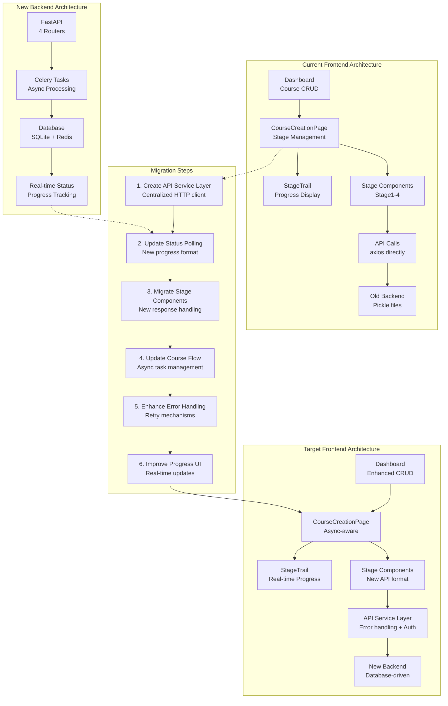

# Frontend Migration Plan - New Backend Architecture

## 🎯 Overview

This document outlines the migration plan for the React frontend to work with the new database-driven backend architecture. The migration focuses on moving from file-based polling to real-time database-driven progress tracking.

## 📊 Current State Analysis

### ✅ What Works Well (Keep)
- **Auth0 Integration**: Already properly implemented
- **Stage-based Architecture**: 4-stage UI flow matches backend
- **Component Structure**: Well-organized React components
- **Toast Notifications**: Good user feedback system
- **Responsive Design**: Tailwind CSS styling

### ❌ What Needs Migration
- **API Service Layer**: Direct axios calls scattered across components
- **Status Polling**: Using old format, needs real-time updates
- **Error Handling**: Basic error handling, needs retry mechanisms
- **Progress Tracking**: Simple progress bars, needs enhanced visualization
- **Data Mapping**: Old response formats, needs new structure handling

## 🔄 Migration Strategy

### Architecture Overview



### Phase 1: API Service Layer (Priority 1)

**Goal**: Centralize all API calls with proper error handling and authentication

**Changes Needed**:
1. Create `frontend/src/services/apiService.js`
2. Implement centralized HTTP client with interceptors
3. Add automatic token refresh and error handling
4. Create typed service functions for each endpoint

**New API Endpoints** (from test automation):
```javascript
// Course Management
POST /api/projects/              // Create course
GET /api/projects/               // List courses  
GET /api/projects/{id}           // Get course
PUT /api/projects/{id}           // Update course
DELETE /api/projects/{id}        // Delete course

// Course Generation (4-stage flow)
POST /api/course-generation/{id}/start                    // Start Stage 1
GET /api/course-generation/{id}/status                    // Real-time status
GET /api/course-generation/{id}/stage1                    // Stage 1 results
POST /api/course-generation/{id}/stage1/selections        // Stage 1 input
POST /api/course-generation/{id}/stage2                   // Start Stage 2
GET /api/course-generation/{id}/stage2                    // Stage 2 results
POST /api/course-generation/{id}/stage3                   // Start Stage 3
GET /api/course-generation/{id}/stage3                    // Stage 3 results
POST /api/course-generation/{id}/stage4                   // Start Stage 4
GET /api/course-generation/{id}/stage4                    // Stage 4 results
```

### Phase 2: Status Polling Update (Priority 1)

**Goal**: Implement real-time progress tracking using new database-driven status

**Current Status Format**:
```javascript
// OLD: Simple status object
{
  current_stage: "clone_repo",
  status: "running",
  progress_percentage: 45
}
```

**New Status Format**:
```javascript
// NEW: Detailed stage tracking
{
  course_id: "uuid",
  current_stage: "stage1",
  status: "running",
  progress_percentage: 45,
  stage_statuses: {
    "CLONE_REPO": "completed",
    "DOCUMENT_ANALYSIS": "running", 
    "PATHWAY_BUILDING": "pending",
    "COURSE_GENERATION": "pending"
  },
  database_status: "stage2_running"
}
```

**Changes Needed**:
1. Update `CourseCreationPage.jsx` polling logic
2. Modify `StageTrail.jsx` to use new progress format
3. Add real-time status updates (consider WebSocket for future)
4. Implement automatic stage progression

### Phase 3: Stage Components Migration (Priority 2)

**Goal**: Update each stage component to handle new API responses

**Stage 1 Component**:
```javascript
// OLD: File-based results
{
  files: [...],
  folders: [...]
}

// NEW: Database-driven results  
{
  repo_name: "project-name",
  available_folders: [...],
  available_files: [...],
  suggested_overview_docs: [...],
  total_files: 150
}
```

**Stage 2 Component**:
```javascript
// NEW: Enhanced document analysis
{
  processed_files_count: 25,
  failed_files_count: 0,
  analyzed_documents: [{
    id: "doc-uuid",
    filename: "guide.md",
    path: "docs/guide.md",
    metadata: {
      doc_type: "guide",
      complexity_level: "intermediate",
      key_concepts: [...],
      learning_objectives: [...]
    }
  }]
}
```

**Changes Needed**:
1. Update `Stage1Component.jsx` - repository file handling
2. Update `Stage2Component.jsx` - document analysis display
3. Update `Stage3Component.jsx` - pathway selection
4. Update `Stage4Component.jsx` - course generation results

### Phase 4: Course Flow Enhancement (Priority 2)

**Goal**: Implement proper async task management with user feedback

**Current Flow Issues**:
- Manual stage progression
- Limited error handling
- No retry mechanisms
- Simple progress feedback

**New Flow Features**:
1. **Automatic Stage Progression**: Move to next stage when ready
2. **Enhanced Error Handling**: Retry failed operations
3. **Real-time Feedback**: Live progress updates
4. **Stage Validation**: Prevent invalid transitions

**Changes Needed**:
1. Update `CourseCreationPage.jsx` with async state management
2. Add retry logic for failed operations
3. Implement stage validation rules
4. Add loading states and progress indicators

### Phase 5: Error Handling & UX (Priority 3)

**Goal**: Provide robust error handling and excellent user experience

**Enhanced Error Handling**:
```javascript
// Error types to handle
const ErrorTypes = {
  NETWORK_ERROR: 'Network connection failed',
  AUTH_ERROR: 'Authentication expired',
  VALIDATION_ERROR: 'Invalid input data',
  TASK_FAILED: 'Background task failed',
  TIMEOUT_ERROR: 'Operation timed out'
};

// Retry strategies
const RetryStrategies = {
  EXPONENTIAL_BACKOFF: 'Exponential backoff',
  IMMEDIATE: 'Immediate retry',
  MANUAL: 'Manual retry only'
};
```

**UX Improvements**:
1. **Loading States**: Skeleton screens for better perceived performance
2. **Progress Visualization**: Enhanced progress bars with ETA
3. **Error Recovery**: Clear error messages with retry options
4. **Offline Support**: Handle network disconnections gracefully

## 🔧 Implementation Plan

### Step 1: Create API Service Layer
```bash
# Create new API service
touch frontend/src/services/apiService.js
touch frontend/src/services/courseService.js
touch frontend/src/services/generationService.js
```

### Step 2: Update Status Polling
```bash
# Update existing files
# - src/pages/CourseCreationPage.jsx
# - src/components/StageTrail.jsx
```

### Step 3: Migrate Stage Components
```bash
# Update all stage components
# - src/components/Stage1Component.jsx
# - src/components/Stage2Component.jsx  
# - src/components/Stage3Component.jsx
# - src/components/Stage4Component.jsx
```

### Step 4: Add Error Handling
```bash
# Create error handling utilities
touch frontend/src/utils/errorHandler.js
touch frontend/src/hooks/useRetry.js
```

### Step 5: Testing
```bash
# Test with backend
npm run dev
# Run through complete course generation flow
```

## 📝 Code Examples

### API Service Layer
```javascript
// frontend/src/services/apiService.js
import axios from 'axios';
import { useAuth0 } from '@auth0/auth0-react';

class ApiService {
  constructor() {
    this.baseURL = import.meta.env.VITE_API_BASE_URL || 'http://localhost:8000/api';
    this.client = axios.create({ baseURL: this.baseURL });
    this.setupInterceptors();
  }

  setupInterceptors() {
    // Add auth token to requests
    this.client.interceptors.request.use(async (config) => {
      const token = await this.getToken();
      if (token) {
        config.headers.Authorization = `Bearer ${token}`;
      }
      return config;
    });

    // Handle response errors
    this.client.interceptors.response.use(
      (response) => response,
      (error) => this.handleError(error)
    );
  }

  async handleError(error) {
    // Centralized error handling
    if (error.response?.status === 401) {
      // Handle auth errors
      await this.refreshToken();
      return this.client.request(error.config);
    }
    throw error;
  }
}
```

### Enhanced Status Polling
```javascript
// Updated polling logic
const pollTaskStatus = async () => {
  try {
    const response = await generationService.getStatus(courseId);
    const statusData = response.data;
    
    // Update UI with new status format
    setTaskStatus(statusData);
    updateStageProgress(statusData);
    
    // Auto-load stage data when completed
    await loadCompletedStageData(statusData);
    
    // Continue polling if still running
    if (statusData.status === 'running') {
      setTimeout(pollTaskStatus, 2000);
    }
  } catch (error) {
    handlePollingError(error);
  }
};
```

## 🎯 Success Criteria

### Phase 1 Success
- [ ] All API calls centralized in service layer
- [ ] Proper error handling and retry mechanisms
- [ ] Token refresh working automatically

### Phase 2 Success  
- [ ] Real-time progress tracking working
- [ ] Stage progression happening automatically
- [ ] Progress bars showing accurate completion

### Phase 3 Success
- [ ] All stage components working with new API
- [ ] Data display correct for new response format
- [ ] Stage transitions smooth and validated

### Phase 4 Success
- [ ] Complete course generation flow working
- [ ] Error handling providing good user feedback
- [ ] Retry mechanisms helping recover from failures

## 📅 Timeline

**Week 1**: API Service Layer & Status Polling
**Week 2**: Stage Components Migration  
**Week 3**: Course Flow Enhancement
**Week 4**: Error Handling & UX Polish
**Week 5**: Testing & Bug Fixes

## 🔗 Dependencies

- New backend API endpoints must be stable
- Database schema must be finalized
- Auth0 configuration needs to remain consistent
- Test automation script should pass end-to-end

## 🚀 Migration Execution

The migration will be executed in a backward-compatible way:
1. Add new API service layer alongside existing calls
2. Gradually replace old API calls with new service
3. Test each stage thoroughly before moving to next
4. Keep old code as fallback until migration complete
5. Remove old code only after full testing

This approach ensures the frontend remains functional throughout the migration process. 